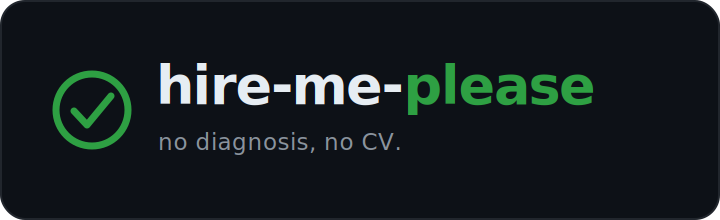

<p align="center">
  
</p>

<p align="center">
  <em>No diagnosis, no CV.</em>
</p>

<p align="center">
  A diagnosis-first job search system for Claude. Eight skills, one pipeline:<br>
  discover, diagnose, tailor, cover, interview prep, story bank.
</p>

<p align="center">
  
  
  
  
  
</p>

---

## Why this exists

Most AI resume tools take a job description and a CV, ask the model to "tailor," and ship whatever comes out. The output reads tailored. It rarely is. The headline shifts, a keyword or two gets sprinkled in, and the same generic bullets appear under every application.

`hire-me-please` does the opposite. Every CV starts with a one-page **diagnosis**: what is this team actually hiring to fix, what would a great hire deliver in 90 days, what is the real bar, which of the candidate's credentials speaks loudest to that bar, and which JD keywords must appear verbatim. No diagnosis, no CV. The diagnosis drives every bullet on the page.

The render is built on `docxtpl` with a small set of hard-won rules (`autoescape=True` is mandatory, a `RichText` helper handles inline bold, a seven-check post-render audit catches the specific failure modes that have shipped broken CVs in the past). The cover letter skill takes a voice reference file in the candidate's own writing and refuses to draft without it.

It is opinionated. It will tell you when you are about to skip something the framework was built to prevent.

## Before / after

Same candidate, same role. One bullet written the way most tools write it, one written off the diagnosis.

```
Before (prompt-and-pray):
  Experienced product manager skilled in workflow automation, cross-functional
  leadership, and B2B SaaS, with a proven track record of driving results.

After (diagnosis-first):
  Cut new-user time-to-value from three weeks to six days by rebuilding onboarding
  around the one workflow that predicted retention. Raised 7-day activation 32% to 38%.
```

The "before" bullet survives a find-and-replace of the role title. The "after" one does not. That is the whole game. See a full run in [examples/showcase/](examples/showcase/).

## What makes this different

| Most AI resume tools | hire-me-please |
| --- | --- |
| Prompt-and-pray rendering | `docxtpl` with `autoescape=True` enforced; ampersand-strip and empty-bold-bullet regressions guarded by audit checks |
| One CV style | Modular sections: toggle summary / additional / publications / certifications per user and per application |
| Generic cover letters | Voice anchor required; opener must be load-bearing on the role's specifics |
| No memory of failure modes | Seven-check post-render audit names actual incidents (the `&` strip, the empty-bold regression, the em-dash, the employment gap from a dropped contiguous block) and fails the build if they recur |
| Tailoring = keyword sprinkling | Diagnosis-first hard gate; every bullet defensible against *"what is this team actually hiring to fix?"* |

## The eight skills

- **role-diagnosis** is the editorial gate. A five-section template that drives every downstream choice.
- **cv-tailor** renders via `docxtpl`: modular section composition, regional headers, a seven-check post-render audit, and an opt-in inline-bold toggle (`cv.inline_bold`).
- **cover-letter** is voice-anchored, sub-300-word, no-em-dash, with the operational test *"could this sentence appear in any cover letter?"*
- **interview-prep** gives you a role snapshot, a STAR+R story map, hard questions, and your ask.
- **story-bank** maintains a STAR+R story library, refreshed from your career file.
- **job-discovery** searches job boards (Indeed, Apify-LinkedIn, and adapter-configured platforms), scores roles, and appends to an Excel job log with backup-before-touch safety.
- **job-search-pipeline** is the orchestrator. It chains everything and owns the 11-command shortcut DSL (`Run [Country]`, `Run [Country] | [Branch]`, `Run Remote`, `Run CV only`, `Run Request`, `Run Blacklist`, `Run Interview Prep`, `Run Story Bank Refresh`, and more). See [CHEATSHEET.md](./CHEATSHEET.md) for the full reference.
- **job-search-setup** is the first-run wizard. It reads your career file, proposes branches, prompts for voice references, picks output formats, and writes config files to `config/`.

## Install

### Claude Code (recommended)

```bash
claude plugin marketplace add sherifscript/hire-me-pls
claude plugin install hire-me-please@sherifscript
```

All eight skills install in one command. Say *"set up hire-me-please"* to run the first-time wizard.

### Local plugin (development or offline)

```bash
git clone https://github.com/sherifscript/hire-me-pls.git
claude --plugin-dir ./hire-me-pls
```

Or add it permanently with `claude plugin install --scope user ./hire-me-pls`.

### Claude Cowork (desktop)

1. Clone the repo: `git clone https://github.com/sherifscript/hire-me-pls.git ~/hire-me-pls`
2. Open Claude desktop, Cowork tab, and select the cloned folder as your working directory.
3. Cowork auto-detects the `skills/` directory. Say *"set up hire-me-please"* to trigger the setup wizard.

### claude.ai upload

Upload the eight `skills/*/SKILL.md` files to a claude.ai Project's Knowledge, and optionally the `references/` files for richer behavior. Claude.ai cannot run the Python rendering scripts, so this method is best for the editorial skills (diagnosis, cover-letter, interview-prep, story-bank). CV rendering requires local Python.

## First run

After install, in any Claude session inside the project folder:

```
You: set up hire-me-please
```

The setup wizard will:

1. Ask for your career history file (free-form text or markdown is fine, no template to fill).
2. Read it once and propose 2 to 4 candidate **branches** (distinct career arcs you might emphasize for different roles). You accept, edit, or reject.
3. Ask which **regions** you target (US, UK, EU, Gulf, etc.) and offer to draft headers for each.
4. Ask whether you have **voice reference files** (old cover letters or application essays in your own writing) and where to find them.
5. Pick your **output formats**: `docx` only (default) or `docx + pdf` (warns about the LibreOffice dependency and extra render cost).
6. Write `config.yaml`, `branches.yaml`, and `regional-headers.yaml` into `config/`. Career file and voice references are expected under `assets/`.

Then run any of the shortcut commands:

```
You: Run Denmark
You: Run Denmark | Product Management
You: Run Remote
You: Run CV only: General
You: Run Request: https://linkedin.com/jobs/view/...
You: Run Interview Prep: Stripe, Senior Product Manager
You: Run Blacklist: add Acme Corp
You: Run Story Bank Refresh
```

See [CHEATSHEET.md](./CHEATSHEET.md) for the full 11-command reference.

## Showcase

The [`examples/showcase/`](examples/showcase/) folder is a complete, frozen end-to-end run for a fictional candidate: a senior product manager moving from B2C consumer apps to B2B SaaS. It contains the candidate profile, config files, the five-section diagnosis, the rendered CV, the cover letter, an interview-prep doc, and LinkedIn messages for one target role (Northwind Operations, Senior PM). Every artifact was produced by the actual skills, and the CV passed all seven audit checks before it was placed there.

<!--
  Reserved hero slot. When a rendered-CV screenshot is available, drop it in as
  docs/showcase-cv.png and uncomment:
  <p align="center"></p>
-->

## FAQ

**Does it need a config file?**
One, and the setup wizard writes it for you. You answer a few questions, it writes `config.yaml`, `branches.yaml`, and `regional-headers.yaml`.

**Will it write a cover letter without a writing sample?**
No. No voice reference, no cover letter. A cover letter in a voice that is not yours is worse than none.

**Can I skip the diagnosis and just get a CV?**
Once per session, after it tells you what the diagnosis was going to catch. Or run `Run CV only` and own the trade.

**Will my CV look AI-generated?**
That is what the audit is for. No em dashes, no reflexive bold, no stripped ampersands, no phantom employment gaps. Seven checks, run on every render.

**Does it submit applications for me?**
No. It produces the documents. You hit send. You should read them first anyway.

**Claude.ai or Claude Code?**
Either for the editorial skills. CV rendering needs local Python (`docxtpl`), so use Claude Code or Cowork for the full pipeline.

## Troubleshooting

**The plugin shows up as "Hire Me Pls" (raw, title-cased) or its skills appear empty.**
The marketplace cache predates the current release. Run `claude plugin marketplace update sherifscript`, then reinstall. Some app surfaces (such as the Claude Desktop plugin directory) title-case the raw `name` field instead of honoring `displayName: "Hire Me, Please"`, which is why the plugin is named `hire-me-please`.

**The marketplace shows the full `.git` URL instead of `sherifscript/hire-me-pls`.**
Cosmetic. It happens when the marketplace was added by full git URL rather than GitHub shorthand. Re-add it so it registers as a `github` source:

```
/plugin marketplace remove sherifscript
/plugin marketplace add sherifscript/hire-me-pls
```

**Claude Desktop users:** update or re-add the marketplace rather than sideloading a zip. A sideloaded zip will not pick up manifest or marketplace updates on its own.

## Scope and non-goals

`hire-me-please` targets the **modern CV** format used across the US, UK, EU, MENA, and most of Asia outside Japan. Explicit non-goals:

- **German Lebenslauf** (photo, DOB, marital status, signature) is not supported. The German market does accept modern CVs, especially for tech and international roles.
- **Japanese Rirekisho / Shokumukeirekisho** is not supported.
- **Multi-candidate management** for career coaches is out of scope. Each candidate runs in a separate project folder.
- **Direct ATS submission** is out of scope. hire-me-please produces the documents; you submit them.

## Opinionation policy

The framework has hard gates (no diagnosis means no CV, no voice reference means no cover letter, max 3 experience slots by default). When you ask Claude to skip a gate, the first time per session it explains the gate and the failure mode it prevents. After that, it complies silently. Power users can tighten or loosen any gate in `config.yaml`.

This is **less strict than the original private workflow** the framework was extracted from, which refuses outright. If you want that behavior, set `opinionation: strict` in `config.yaml`.

## Requirements

- Claude Code, Claude desktop with Cowork, or claude.ai Projects.
- Python 3.10+ for the CV render scripts.
- `docxtpl`, `python-docx`, `openpyxl`, `PyYAML` (install via `pip install -r requirements.txt`).
- Optional: LibreOffice for PDF output, and a web scraper account (such as Apify) for job board discovery (LinkedIn, Wuzzuf, etc.).

## Star history

<p align="center">
  <a href="https://star-history.com/#sherifscript/hire-me-pls&Date">
    
  </a>
</p>

## License

[CC BY-NC 4.0](./LICENSE). Free to share and adapt for non-commercial use with attribution.

## Credits

Extracted from a real personal workflow built over many months of job searching. The named failure modes guarded by the audit (the `Artist & Label` becoming `Artist  Label` ampersand strip, the empty-bold-bullet regression, the "every CV looked tailored, none were" diagnosis-skip incident) all happened. Those are the scars this framework was built around.

See [CHANGELOG.md](./CHANGELOG.md) for version history. Current release: **v1.4.1**.
